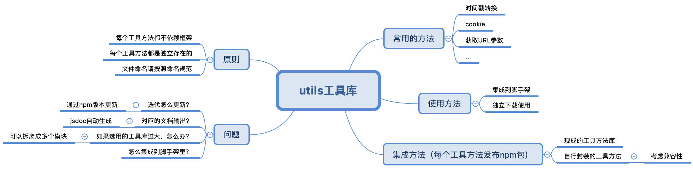
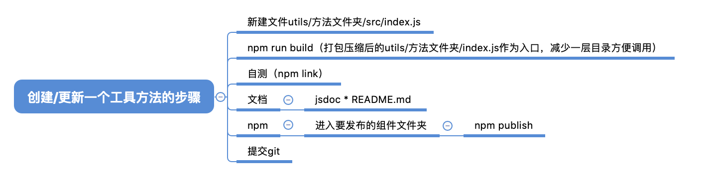
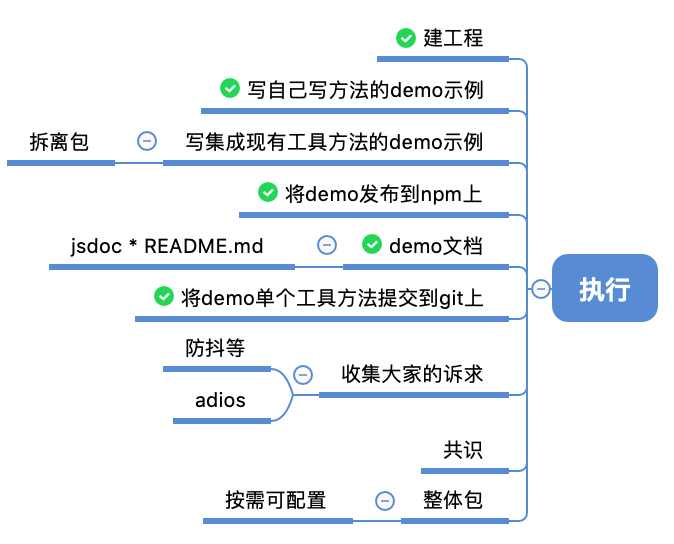

**utils工具库**

    git地址：https://github.com/ktQueen/utils.git
    
    包地址：https://www.npmjs.com/package/front-end-utils
    
    API地址：当前工程utils/out/index.html（通过JSDOC生成）

**使用工具方法的步骤：**

    安装工具函数：npm i front-end-utils
    
    使用工具函数：import 具体的工具方法 from front-end-utils/+文件夹名称
    
    （在api里找，你想用啥，文件夹名称就是啥）

**注意事项**

    每个工具方法都是独立存在的
    
    每个工具方法都不依赖框架
    
    文件命名请按照命名规范
    
    包名前缀是front-end-utils/+文件夹名称(模块名称最好和文件夹名称对应，这样方便好找)
    
    文件变化通过版本号进行更新
    
    集成进脚手架，工具包采用整体下载，单个引入的方法
    
    代码写es6,webpack编译后发布编译后的es5的包

**创建/更新一个工具方法的步骤：**

    ⚠️注意：如果是集成现有的工具方法到工具库，工具方法过大，则拆离成多个工具方法再进行以下操作,
    
           如果工具库中方法相互依赖过多或过深，酌情可以自己写对应的方法
    
    1、在utils新建一个方法文件夹，
    
       方法文件夹里新建一个src文件夹，
    
       src文件夹里面新建index.js入口文件(如果方法较多请拆离一个工具方法文件，将index.js作为入口文件)
    
    2、开发完成后，在utils目录文件下编译，会在方法文件夹下生成一个编译好的index.js文件
    
        npm run build
    
    3、编译完成后，
    
       在utils下执行(npm link),
    
       在可用工程中执行(npm link front-end-utils)，直接require/important引入使用看否能自测通过
    
       import 方法 from 'front-end-utils/文件名';
    
    4、自测通过后生成文档，在utils文件目录下执行 npm run docs(具体请看《文档生成方法》)
    
    5、更新文档后进行发布
    
        更改utils文件目录下的package.json文件的version版本号（只能有一个版本）
    
        在utils文件目录下执行 npm publish
    
    6、提交到git

**文档生成方法：**

    1、全局安装jsDoc：npm install -g jsdoc
    
    2、方法的注释参照jsdoc的规则：https://www.css88.com/doc/jsdoc/index.html
    
    3、目录文件下命令生成文档： jsdoc **/src/** README.md（这样输出的是src文件下的目录）
    
       会生成一个名为out的新文件夹，打开文件夹中的index.html,可以看到生成好的文档

**npm使用方法：**

    一：切换npm源
    
        方法一：使用nrm管理工具
    
            1. 安装管理工具nrm：npm install -g nrm
    
            2. 新增镜像源： nrm add <源名称>         (其中<源名称>自定义)
    
            3. 查看已有镜像源： nrm ls
    
            4. 切换镜像源： nrm use   <源名称>
    
        方法二：通过 config 配置指向镜像源：
    
            执行：npm config set registry http://registry.npmjs.org/ //配置指向源
    
            查看配置是否生效：找到配置文件.npmrc查看repository地址是否为registry=配置地址。 也可手动更改。
    
        方法三：在项目根目录下添加 .npmrc
    
            registry=http://registry.npmjs.org/
    
    二：登录
        1. 进入要发布的组件文件夹
    
        2. 执行npm addUser
    
            username
    
            password
    
            email
    
    三：发布与取消发布
    
        发布执行：npm publish(如果发布有命名空间的包：npm publish --access=public)
    
        取消发布执行：npm unpublish xxxx@1.0.0
    
    四：发布模块到npm注意事项
    
            1. 发布的模块版本号不能重复
    
            2. 测试时发布的模块版本号尽量使用小版本号
    
    参考文献：https://greenfavo.github.io/blog/docs/04.html

**utils工具方法具体执行：**

